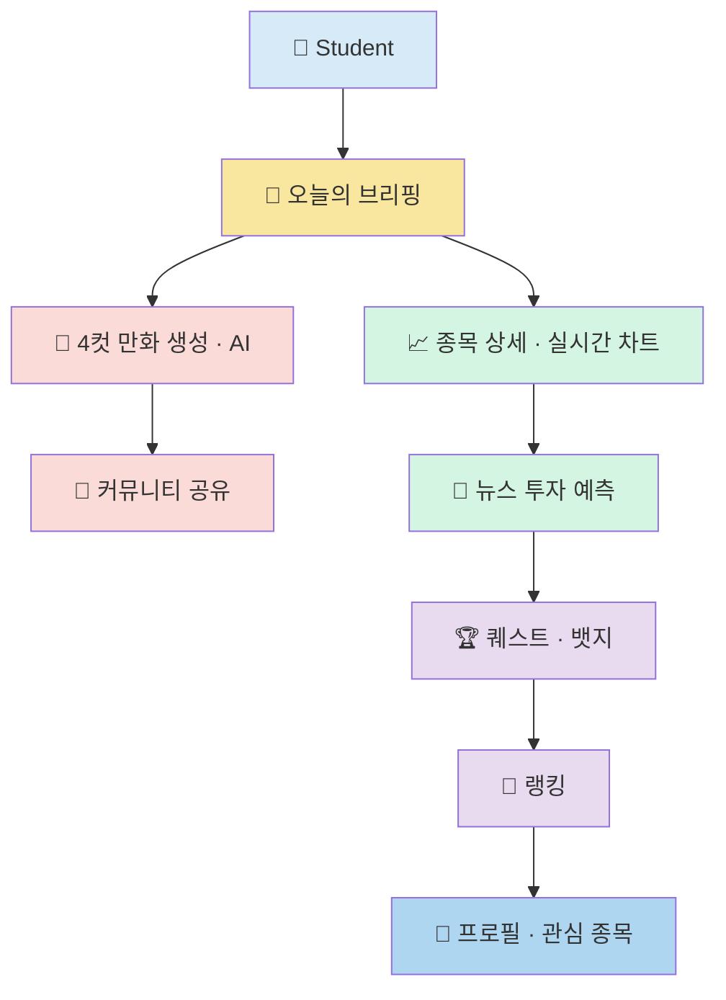

# Architecture



## Tech Stack

### Frontend

- React 19
- TypeScript
- Vite
- TailwindCSS (v4)
- Motion (애니메이션)
- Lucide React (아이콘)
- Recharts (주식 차트 시각화)

### Backend

- Node.js
- Express (`/api/generate-cartoon` 등 서버 API 라우트)

### AI

- Google Gemini API (`@google/genai`) — 뉴스 기반 4컷 만화 시나리오 생성

### 외부 데이터 연동

- Finnhub Stock REST API (선택적) — API 키 설정 시 실시간 글로벌 시세 연동
- 미설정 시 KRX 기준 자체 시세 시뮬레이션 파이프라인으로 대체 동작 (데이터 출처를 화면에 투명하게 표시)

### 개발 환경

- VSCode
- npm / bun

---

## 프론트엔드 구조 (실제 코드 기준)

```
src
├── components
│   ├── LandingPage.tsx
│   ├── LoginModal.tsx
│   ├── Header.tsx
│   ├── Sidebar.tsx
│   ├── TodayBriefing.tsx
│   ├── NewsComicModal.tsx
│   ├── CartoonModal.tsx
│   ├── CommunityView.tsx
│   ├── StockDetailView.tsx
│   ├── StockChartModal.tsx
│   ├── PredictionView.tsx
│   ├── QuestsView.tsx
│   ├── RankingView.tsx
│   ├── ProfileView.tsx
│   └── ResetConfirmModal.tsx
│
├── services
│   └── stockService.ts        # 실시간 시세 / 차트 데이터 fetch
│
├── types.ts                    # 전역 타입 (User, NewsArticle, Prediction 등)
├── mockData.ts                 # 목업 데이터
├── App.tsx                     # 전역 상태 관리 및 라우팅(탭 전환)
└── main.tsx
```

## 상태 관리 방식

- 별도 상태관리 라이브러리 없이 `App.tsx`의 `useState`로 전역 상태(User, Articles, Predictions, Quests, Rankings 등)를 관리
- 각 화면(View) 컴포넌트는 props로 상태와 핸들러를 전달받는 단방향 데이터 흐름 구조
