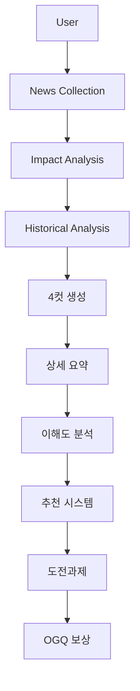

# Architecture

## System Architecture

```mermaid
flowchart TD

A[User]

--> B[News Collection]

B --> C[Impact Analysis]

C --> D[Historical Analysis]

D --> E[4컷 생성]

E --> F[상세 요약]

F --> G[이해도 분석]

G --> H[추천 시스템]

H --> I[도전과제]

I --> J[OGQ 보상]
```

## Tech Stack

Frontend

- Next.js

- React

- TypeScript

- TailwindCSS

Backend

- Supabase (예정)

AI

- OpenAI API (예정)

News

- NewsAPI (예정)
